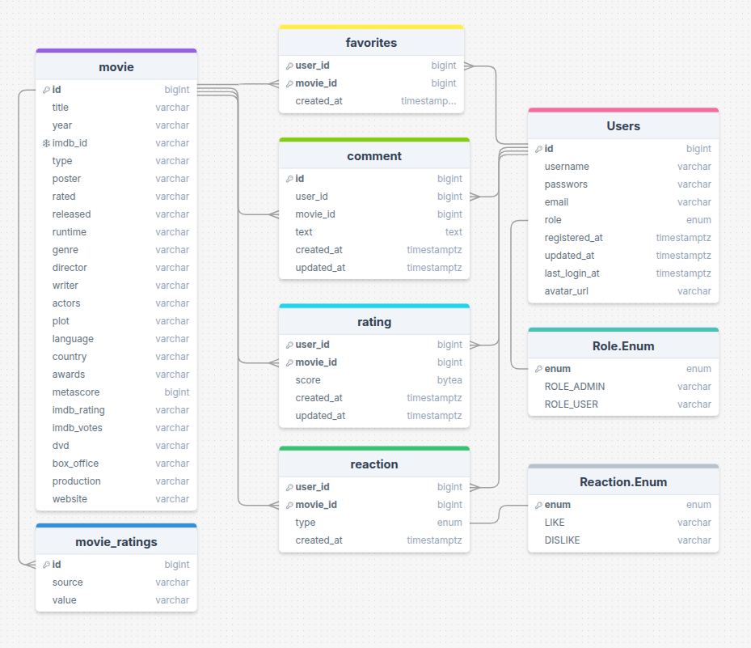

# 🧩 Features
- **🔍 Search movies by title:** Enter the title of the movie and get a list of relevant results, including poster, year of release and type (movie, series, episode).  
- **🧠 Filter by year and content type:** Refine your search by specifying the year and category (movie / series / episode).  
- **📄 View detailed information about the movie:** Go to the movie page and study the full information: plot, actors, genre, awards, rating and much more.  
- **🕘 Search history:** The application automatically saves the last 5 queries for quick re-access.  
- **💾 Save search state:** When you return to the main page (for example, via the "back" button in the browser), search results and filters are restored automatically.  
- **🎲 Random movie:** The "Random Movie" button will find a random movie from the OMDb database, perfect for inspiration.
- **🧼 Adaptive and minimalist interface:** The components are implemented with attention to detail, responsive design and user-friendliness.  

## 👤 User Capabilities
- **🔐 Register and log in:** Create an account using email and password. The system protects data with Spring Security.  
- **📝 Edit profile:** The user can change the name, email or password. All changes are validated and saved in the database.  
- **🖼️ Upload a profile photo:** You can upload your own image through the form. The avatar is displayed on the profile page and can be updated at any time.  
- **⭐ Manage favorite movies:** Add and remove movies from your favorites list. The list is saved between sessions.  

## 🔧 Technologies:
### Frontend:
- React JS.

### Backend:
- **Language:** Java 21,
- **Framework:** Spring Boot (Web, Data JPA, Security),
- **ORM:** Hibernate.
- **Authentication:** JWT
- **Caching:** Redis
- **Cloud Storage:** Cloudinary

### External API:
- OMDb API.

## 🗄 Database diagram
